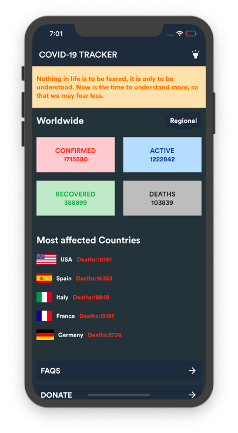
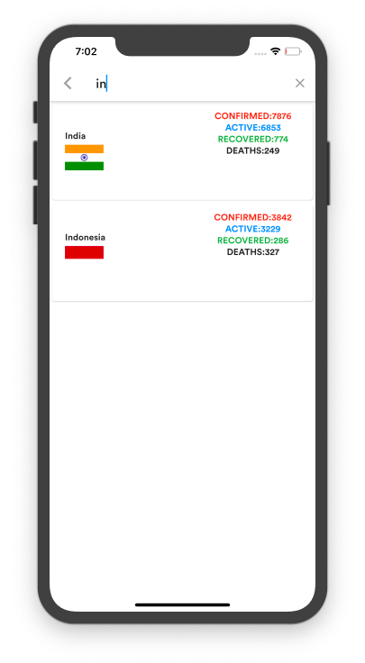

# covid_19 tracker
An open-sourced Mobile application to track the COVID-19 cases made using Flutter. 

## Features
- Get worldwide COVID-19 cases
- Coutry-wise data
- Added Dark mode
- Realtime search based on country name

 
